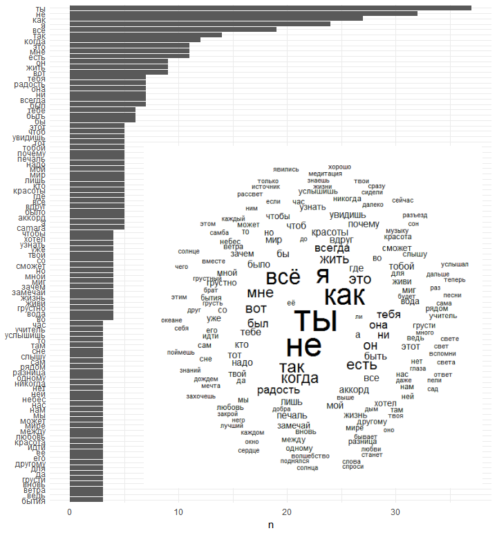
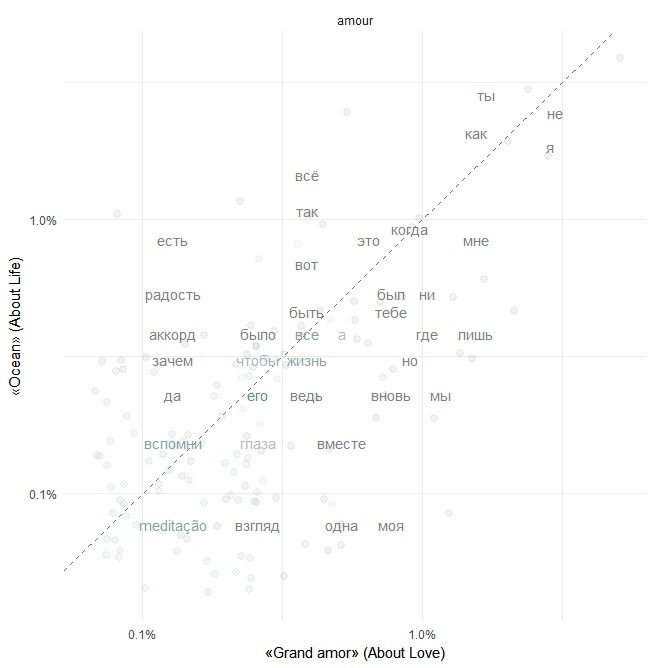

# Приложение: Анализ лирики {#TextMining .unnumbered}

## Most frequently used words {-}

Часть 1: «Grand amor»  (About Love) 


```{r,  out.width='100%', fig.align='center', echo=FALSE}
knitr::include_graphics("c_jobim/words_amour.png")

```


Часть 2:  «Ocean»  (About Life)

```{r,  out.width='100%', fig.align='center', echo=FALSE}

```


## About Love vs. about Life {-}


```{r,  out.width='100%', fig.align='center', echo=FALSE}

```


